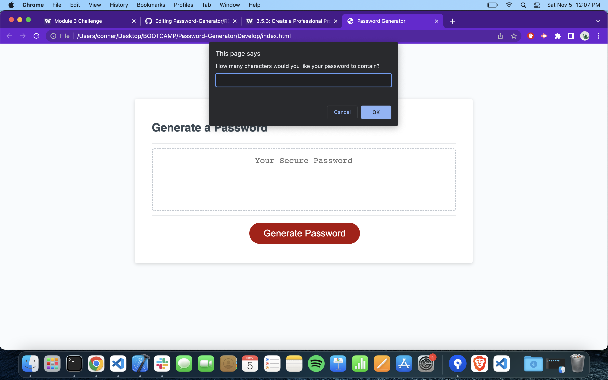
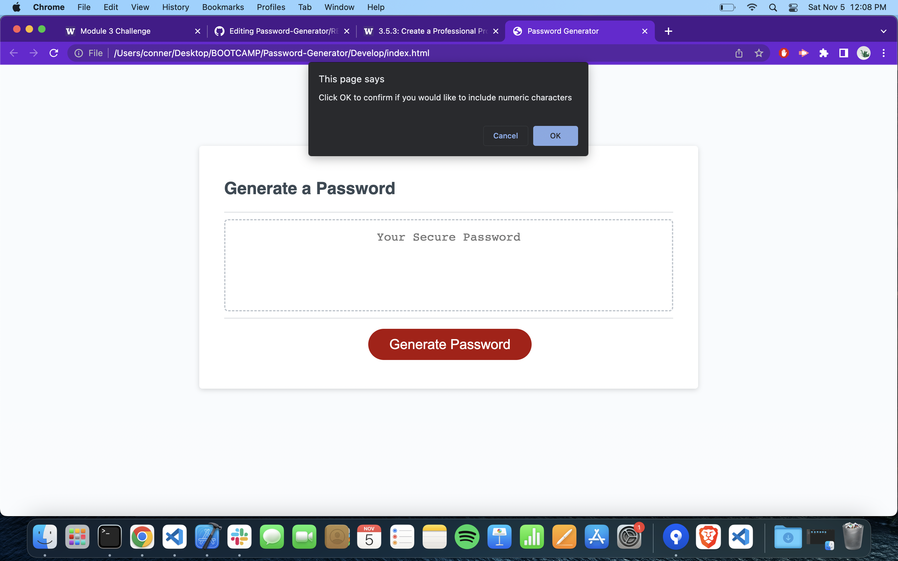
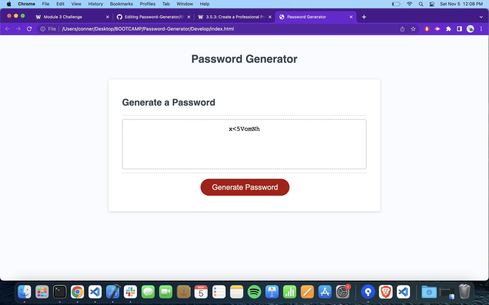

# Password-Generator
Week 3 JavaScript Challenge Password Generator

## Description
This is the third challenge assignment due on 11/10/22.

## Usage
The js code was created in order to fulfill the acceptance criteria. In this case, we needed prompts for password criteria for the random password generator. Each prompt asks the user to either input a length, or confirm/deny which parameters the password should contain for special characters, numbers, uppercase and lowercase letters.

The password gets displayed in the box after the prompts are completed.

The app has multiple alert messages, making sure that the answers to the prompts are within the length requirments and that at least one parameter of what type of character to include is selected.

## Link to Deployed Site
https://connerlaursen.github.io/Password-Generator/

Screenshot of Deployed Site

## Licence
MIT license, listed on GitHub.
